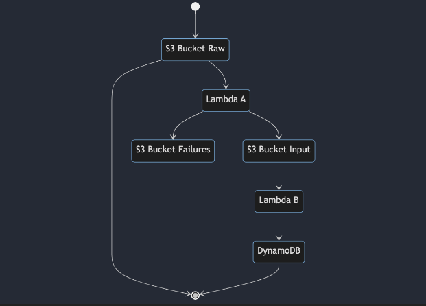

# AWS Serverless CDK Training 

Training project for learning how to build a serverless application in AWS using some of the most trending technologies. 

## Overview 

The following diagram exemplifies the complete flow, described below. 

stateDiagram-v2 
state "S3 Bucket Raw" as S3A 
state "S3 Bucket Input" as S3B 
state "S3 Bucket Failures" as S3C 
state "Lambda A" as LambdaA 
state "Lambda B" as LambdaB 
[*] --> S3A 
S3A --> [*] 
S3A --> LambdaA 
LambdaA --> S3B 
LambdaA --> S3C 
S3B --> LambdaB 
LambdaB --> DynamoDB 
DynamoDB --> [*] 

The idea is that: 

New JSON files, compressed with tar.gz are stored on S3 Bucket Raw 

There is a Lambda A, that picks up those files, decompresses them, and splits the objects into smaller JSONs, storing them on S3 Bucket Input. Invalid schemas are sent to S3 Bucket Failures. 

There is another Lambda B, that picks up files from S3 Bucket Input, transforms the objects to DynamoDB records and writes them into the database. 

## Requisites 

Lambdas must be written in Scala using the Feral framework (https://github.com/typelevel/feral) 

All the infrastructure needs to be written in CDK using Typescript 

Ability to test it locally with Docker (using CDK in this case will be a nice to have) 